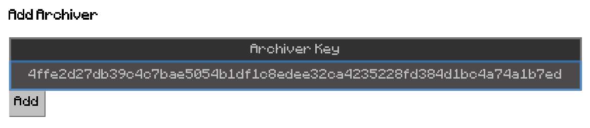
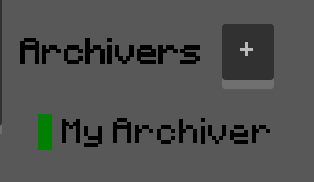

# pixelpusherd

A Node.js-based daemon to provide backups and peers for pixelpusher documents
to facilitate document sharing while clients are offline.

Many pixelpusher clients can share a single pixelpusherd instance.

# Installation

```
npm install -g pixelpusherd
```

# Usage

Run pixelpusherd as a long running process somewhere, typically on a Linux virtual machine in the cloud, or on a home server.

```
$ pixelpusherd --name="My archiver"

$ pixelpusherd --name="My Archiver"
Swarm listening on port 56593
Key: 4ffe2d27db39c4c7bae5054b1df1c8edee32ca4235228fd384d1bc4a74a1b7ed
```

This will create a subdirectory in the current directory `pixelpusherd-archive`
where the data will be stored.

# Connecting Clients

To use it from within pixelpusher, click the Archivers '+' button:


In the dialog that appears, paste in the key that was displayed when you ran `pixelpusherd`:



After clicking 'Add', your pixelpusher client will attempt to connect, and if successful, the connection indicator will turn green:



On the console where pixelpusherd is running, you will see lots of logging output, which you can use to confirm that the archiver is working.

# Community

The pixelpusher project is a demo of what can be built using [Automerge](https://github.com/automerge/automerge).

[Join the Automerge Slack community](https://communityinviter.com/apps/automerge/automerge)

# License

MIT
